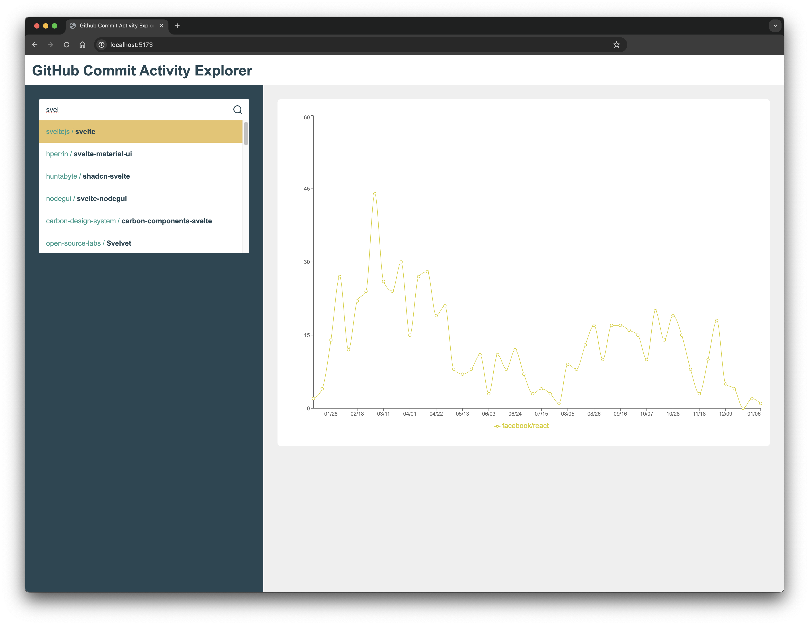
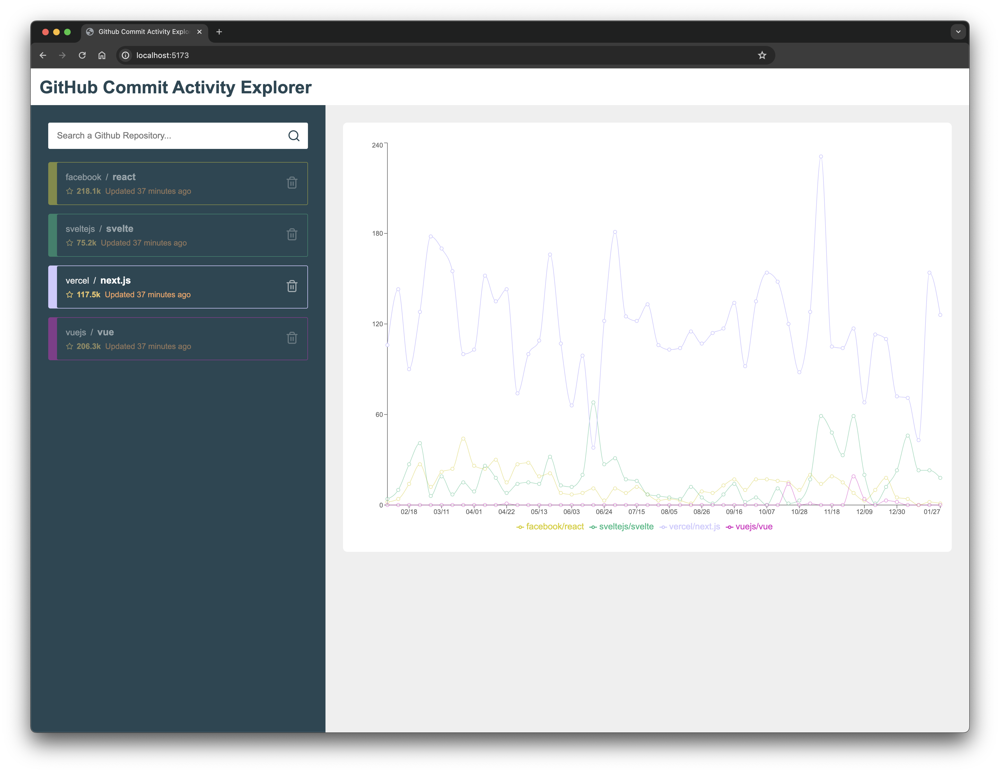

# Github Commit Activity Explorer

A simple app to compare the commit activity of public GitHub repositories.

## Setup

Assuming that you have node installed on your system, run the following commands to start the application:

1. Generate a [GitHub Fine-grained access token](https://github.com/settings/tokens?type=beta)
2. Create a `.env` file at the root and add the access token to it: `VITE_GH_KEY=<your-access-token>`
2. Install dependencies: `npm install`
3. Run dev: `npm run dev`